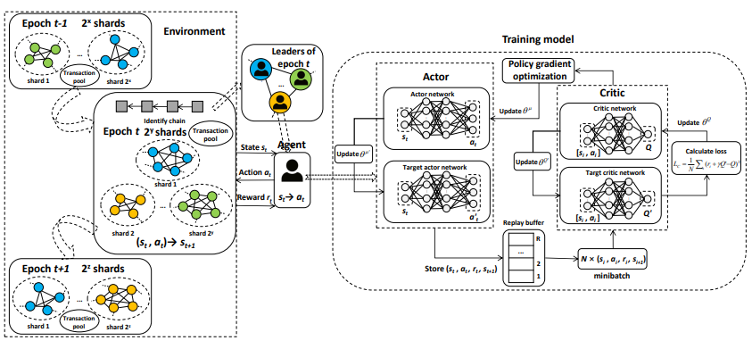
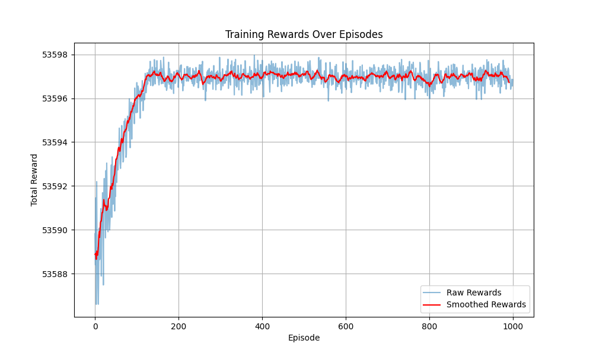

# Deep Deterministic Policy Gradient (DDPG) for Sharding Policy
This repository implements the Deep Deterministic Policy Gradient (DDPG) algorithm for optimizing sharding policies in a blockchain environment. The implementation includes an actor-critic architecture using TensorFlow, a replay buffer for experience replay, and training routines to improve the sharding policy over time.

## Repository Structure
`model.py`: Contains the implementation of the DDPG algorithm, including the actor and critic networks, replay buffer, and training loop.
`Figure.png`: Contains a picture of the result chart.

## Requirements
- Python 3.x
- NumPy
- TensorFlow
- Matplotlib
- TQDM

You can install the required packages using the following command:
`pip install numpy tensorflow matplotlib tqdm`

## Usage
To train the DDPG agent for sharding policy, simply run the model.py script:
`python model.py`

## Implementation Details

### Replay Buffer
The ReplayBuffer class stores experiences and samples them for training the agent.

### Actor Network
The Actor class defines the policy network that outputs actions given the current state.

### Critic Network
The Critic class defines the value network that evaluates the quality of actions taken by the actor.

### DDPG Agent
The DDPGAgent class encapsulates the actor and critic networks, optimizers, and training routines.

### Training Loop
The train_drl_sharding_agent function initializes the agent and runs the training loop for a specified number of episodes. It also visualizes the training rewards over time.

## Customization
You can customize the state and action dimensions, action bounds, and other hyperparameters in the train_drl_sharding_agent function to suit your specific use case.

## Results
The results of the training are visualized in the `Figure.png` file, which shows the performance of the DDPG agent over time.

## Acknowledgements
This implementation is inspired by various research papers and online resources on reinforcement learning and DDPG.
Main research: [SkyChain](https://www.researchgate.net/publication/343538592_SkyChain_A_Deep_Reinforcement_Learning-Empowered_Dynamic_Blockchain_Sharding_System)
